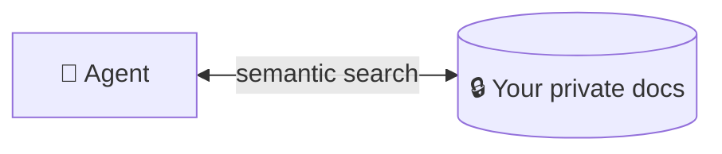
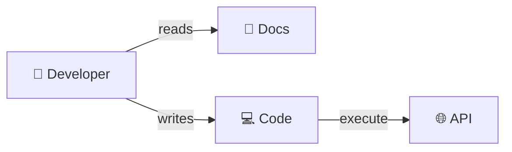
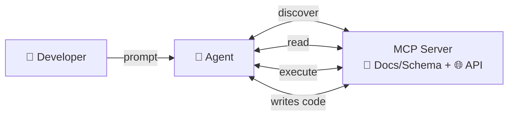
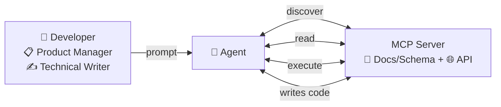

<div class="slide-bg-scrim"></div>

<div style="margin-top: -4rem;">

# <span class="hero-title">Hallucinating our way to AI-backed documentation</span>

<br>

## <span style="font-size: 1.2rem;">PART I - THEORY</span>
  
</div>

---
transition: fade-out
class: text-center
---

<div class="card">

<div class="text-center">

### Who am I

</div>

<div style="display: inline-block; text-align: left;">

<v-clicks depth="6">

- AI Solutions Architect at Cennso
- Independent open-source maintainer - [brainfart.dev](https://brainfart.dev)
- Maintainer of AsyncAPI spec and generator
- Community Servant at Open Source Europe

</v-clicks>

</div>

<v-click>

<div style="margin-top: 1rem; text-align: center;">


</div>

</v-click>

</div>

---
transition: fade-out
class: text-center
---

<div class="card">

<div class="text-center">

### The big words

</div>

<div style="display: flex; flex-direction: column; align-items: center; gap: 0.75rem; margin-top: 1.5rem; font-size: 2rem; font-weight: 700;">

<v-click><div>🤖 Agentic</div></v-click>
<v-click><div>🧠 LLM</div></v-click>
<v-click><div>🔍 RAG</div></v-click>
<v-click><div>🔌 MCP</div></v-click>
<v-click><div>🦮 Skills</div></v-click>

</div>

</div>

---
transition: fade-out
class: text-center
---

<div class="card">

<div class="text-center">

### What is Agentic AI

<v-click>AI without copy/paste</v-click>

</div> 

<div style="margin-top: 0.5rem; position: relative; min-height: 300px;">

<div v-click="2" style="position: absolute; width: 100%;">

**Chat AI:**

<div style="margin-top: 1rem;">


</div>

</div>

</div>

</div>

---
transition: fade-out
---

<div class="card">

<div class="grid-2" style="grid-template-columns: minmax(0, 0.5fr) minmax(0, 4fr); gap: 0.75rem; align-items: center; min-height: 480px;">

<div>

### Agent mode

<v-click>AI without copy/paste</v-click>

</div>

<div style="position: relative; min-height: 480px;">

<div v-click="[2, 3]" style="position: absolute; width: 100%; top: 50%; transform: translateY(-50%); text-align: center;">


</div>

<div v-click="[3, 4]" style="position: absolute; width: 100%; top: 50%; transform: translateY(-50%); text-align: center;">


</div>

<div v-click="4" style="position: absolute; width: 100%; top: 50%; transform: translateY(-50%); text-align: center;">


</div>

</div>

</div>

</div>

---
transition: fade-out
class: text-center
---

<div class="card">

<div class="text-center">

### The big words

</div>

<div style="display: flex; flex-direction: column; align-items: center; gap: 0.75rem; margin-top: 1.5rem; font-size: 2rem; font-weight: 700;">

<div style="text-decoration: line-through; opacity: 0.45;">🤖 Agentic</div>
<div>🧠 LLM</div>
<div>🔍 RAG</div>
<div>🔌 MCP</div>
<div>🦮 Skills</div>

</div>

</div>

---
transition: fade-out
class: text-center
---

<div class="card">

<div class="text-center">

### What is LLM

</div>

<v-click>

<div style="margin-top: 1rem; text-align: center;">


</div>

</v-click>

</div>

---
transition: fade-out
class: text-center
---

<div class="card">

<div class="text-center">

### You don't know what the LLM knows about the Piast dynasty

</div>

<div class="grid-2" style="margin-top: 1.5rem; align-items: end;">

<v-click>

<div>


<p style="margin-top: 0.75rem;"><em>Polska Piastów</em> — Paweł Jasienica</p>

</div>

</v-click>

<v-click>

<div>


<p style="margin-top: 0.75rem;"><em>Drapieżny ród Piastów</em> — Sławomir Leśniewski</p>

</div>

</v-click>

</div>

</div>

---
transition: fade-out
class: text-center
---

<div class="card">

<div class="text-center">

### You don't know where the LLM gets its knowledge about AsyncAPI

</div>

<div class="grid-2" style="margin-top: 1.5rem; align-items: center;">

<v-click>

<div style="text-align: center;">


</div>

</v-click>

<v-click>

<div style="text-align: center;">


</div>

</v-click>

</div>

</div>

---
transition: fade-out
class: text-center
---

<div class="card">

<div class="text-center">

### Blind spot

</div>

<p style="margin-top: 0.5rem;">How can the LLM know about your closed-source product with docs behind a login page?</p>

<div class="grid-2" style="margin-top: 1.5rem; align-items: center;">

<v-click>

<div class="card" style="min-height: 220px; display: flex; flex-direction: column; align-items: center; justify-content: center;">

<div style="font-size: 4rem;">🕳️</div>

<p style="margin-top: 0.5rem;">It can't — just a void</p>

</div>

</v-click>

<v-click>

<div class="card">

<strong>RAG</strong>



</div>

</v-click>

</div>

</div>

---
transition: fade-out
class: text-center
---

<div class="card">

<div class="text-center">

### The big words

</div>

<div style="display: flex; flex-direction: column; align-items: center; gap: 0.75rem; margin-top: 1.5rem; font-size: 2rem; font-weight: 700;">

<div style="text-decoration: line-through; opacity: 0.45;">🤖 Agentic</div>
<div style="text-decoration: line-through; opacity: 0.45;">🧠 LLM</div>
<div>🔍 RAG</div>
<div>🔌 MCP</div>
<div>🦮 Skills</div>

</div>

</div>

---
transition: fade-out
class: text-center
---

<div class="card">

<div class="text-center">

### What is RAG

<v-click at="1">Semantic search over your own content</v-click>

</div>

<div style="display: flex; align-items: center; justify-content: center; gap: 0.5rem; margin-top: 2rem; flex-wrap: wrap;">

<v-click at="2">

<div style="min-height: 130px; box-sizing: border-box; display: flex; flex-direction: column; align-items: center; justify-content: center; border: 3px solid #666; border-radius: 8px; padding: 0.75rem 1rem; box-shadow: 0 4px 8px rgba(0,0,0,0.1); font-weight: 600; line-height: 1.3;">📄<br>Markdown · OpenAPI<br>· AsyncAPI</div>

</v-click>

<v-click at="3">

<div style="display: flex; align-items: center; gap: 0.5rem;"><span style="font-size: 1.75rem;">→</span><div style="min-height: 130px; box-sizing: border-box; display: flex; flex-direction: column; align-items: center; justify-content: center; border: 3px solid #666; border-radius: 8px; padding: 0.75rem 1rem; box-shadow: 0 4px 8px rgba(0,0,0,0.1); font-weight: 600;">✂️<br>Chunks</div></div>

</v-click>

<v-click at="4">

<div style="display: flex; align-items: center; gap: 0.5rem;"><span style="font-size: 1.75rem;">→</span><div style="min-height: 130px; box-sizing: border-box; display: flex; flex-direction: column; align-items: center; justify-content: center; border: 3px solid #666; border-radius: 8px; padding: 0.75rem 1rem; box-shadow: 0 4px 8px rgba(0,0,0,0.1); font-weight: 600;">🔢<br>Embeddings</div></div>

</v-click>

<v-click at="5">

<span style="font-size: 1.75rem;">→</span>

</v-click>

</div>

<div style="display: flex; align-items: center; justify-content: center; gap: 0.5rem; flex-wrap: wrap; margin-top: 0.5rem;">

<v-click at="5">

<div style="display: flex; align-items: center; gap: 0.5rem;"><span style="font-size: 1.75rem;">→</span><div style="min-height: 130px; box-sizing: border-box; display: flex; flex-direction: column; align-items: center; justify-content: center; border: 3px solid #666; border-radius: 8px; padding: 0.6rem 1rem; box-shadow: 0 4px 8px rgba(0,0,0,0.1); font-weight: 600;">🗄️ Vector DB<div style="margin-top: 0.4rem; display: flex; flex-direction: column; gap: 0.25rem; font-size: 0.8rem; font-weight: 500;"><span style="border: 1px dashed #999; border-radius: 4px; padding: 0.15rem 0.4rem;">🔢 vectors</span><span style="border: 1px dashed #999; border-radius: 4px; padding: 0.15rem 0.4rem;">✂️ chunk text</span></div></div></div>

</v-click>

<v-click at="6">

<div style="display: flex; align-items: center; gap: 0.5rem;"><span style="font-size: 1.75rem;">→</span><div style="min-height: 130px; box-sizing: border-box; display: flex; flex-direction: column; align-items: center; justify-content: center; border: 3px solid #2563eb; border-radius: 8px; padding: 0.75rem 1rem; box-shadow: 0 4px 8px rgba(0,0,0,0.1); font-weight: 600;">🔌 MCP layer<div style="margin-top: 0.4rem; font-size: 0.7rem; opacity: 0.7; font-weight: 500; line-height: 1.4;">🔍 search vectors<br>📤 return chunks</div></div></div>

</v-click>

</div>

</div>

---
transition: fade-out
class: text-center
---

<style>
.chunks-view .slidev-code { font-size: 0.6rem !important; line-height: 1.3 !important; }
.chunks-view .slidev-code .line { white-space: pre-wrap; word-break: break-all; }
</style>

<div class="card">

<div class="text-center">

### Chunks

<v-click>One doc → many structure-aware chunks</v-click>

</div>

<div class="chunks-view" style="max-width: 780px; margin: 1.25rem auto 0; text-align: left;">

<v-click>

**📝 Prose**

</v-click>

```json {3,4|6-8}
{
  "chunk_id": "c4ce5efe…382289e",
  "chunk_type": "prose",
  "content": "## Multiple channels with single message when reply address is known\n\nThe request/reply pattern can also be implemented over multiple channels with a single message…",
  "line_start": null,
  "metadata": {
    "source_url": "https://www.asyncapi.com/docs/concepts/asyncapi-document/reply-info"
  },
  "source_file": ".opencrane/llmstxt/llms-full.txt",
  "source_name": "asyncapi-website",
  "token_count": 74
}
```

</div>

</div>

---
transition: fade-out
class: text-center
---

<style>
.chunks-view .slidev-code { font-size: 0.6rem !important; line-height: 1.3 !important; }
.chunks-view .slidev-code .line { white-space: pre-wrap; word-break: break-all; }
</style>

<div class="card">

<div class="text-center">

### Chunks

</div>

<div class="chunks-view" style="max-width: 780px; margin: 1.25rem auto 0; text-align: left;">

**📋 List item**

```json {3,4|6-17}
{
  "chunk_id": "43ca503b…92cd7ef",
  "chunk_type": "list_item",
  "content": "# … AsyncAPI document generation process\n1. The **Generator** receives the **AsyncAPI Document** as input.",
  "line_start": null,
  "metadata": {
    "breadcrumb_path": ".../asyncapi-document AsyncAPI document generation process",
    "depth": 0,
    "list_id": "7222577c705f7892",
    "list_style": "ordered",
    "parent_item_id": null,
    "position": 1,
    "sibling_ids": ["9714fd50…d554292", "b9728c45…fe3aca0", "0616eda6…59fbd81", "bc681ae6…eeea7a4", "537dc8cb…f176ba6"],
    "sibling_previews": ["2. The **Generator** sends to…", "3. The **Parser** validates t…", "4. If the **Parser** determin…", "5. At this point, the **Gener…", "6. The **Template Context** i…"],
    "source_url": "https://www.asyncapi.com/docs/tools/generator/asyncapi-document",
    "total_siblings": 6
  },
  "source_file": ".opencrane/llmstxt/llms-full.txt",
  "source_name": "asyncapi-website",
  "token_count": 37
}
```

</div>

</div>

---
transition: fade-out
class: text-center
---

<style>
.chunks-view .slidev-code { font-size: 0.6rem !important; line-height: 1.3 !important; }
.chunks-view .slidev-code .line { white-space: pre-wrap; word-break: break-all; }
</style>

<div class="card">

<div class="text-center">

### Chunks

</div>

<div class="chunks-view" style="max-width: 780px; margin: 1.25rem auto 0; text-align: left;">

**🗂️ JSON Schema**

```json {3,4-8|10-22}
{
  "chunk_id": "1fcc25de…395bb4",
  "chunk_type": "json_schema",
  "content": {
    "description": "A unique id representing the application.",
    "format": "uri",
    "type": "string"
  },
  "line_start": null,
  "metadata": {
    "breadcrumb_path": "properties.id",
    "logical_parent": "root",
    "neighbor_chunks": ["bdf39a6c…294dec3", "6dad8d11…1c2c319", …],
    "original_format": "yaml",
    "property_name": "id",
    "property_path": "id",
    "schema_element": "properties",
    "schema_title": "AsyncAPI 3.1.0 schema.",
    "schema_type": "json_schema",
    "schema_version": "http://json-schema.org/draft-07/schema",
    "source_url": "https://github.com/asyncapi/website/blob/master/config/3.1.0.json"
  },
  "source_file": ".opencrane/llmstxt/llms-full.txt",
  "source_name": "asyncapi-json-schema",
  "token_count": 17
}
```

</div>

</div>

---
transition: fade-out
class: text-center
---

<div class="card">

<div class="text-center">

### The big words

</div>

<div style="display: flex; flex-direction: column; align-items: center; gap: 0.75rem; margin-top: 1.5rem; font-size: 2rem; font-weight: 700;">

<div style="text-decoration: line-through; opacity: 0.45;">🤖 Agentic</div>
<div style="text-decoration: line-through; opacity: 0.45;">🧠 LLM</div>
<div style="text-decoration: line-through; opacity: 0.45;">🔍 RAG</div>
<div>🔌 MCP</div>
<div>🦮 Skills</div>

</div>

</div>

---
transition: fade-out
class: text-center
---

<div class="card">

### What is MCP

<v-click> API for AI agents </v-click>

<div style="margin-top: 2rem; position: relative; min-height: 300px;">

<div v-click="[2, 3]" style="position: absolute; width: 100%;">

**Traditional API:**

<div style="margin-top: 1rem;">



</div>

</div>


<div v-click="[3, 4]" style="position: absolute; width: 100%;">

**MCP:**

<div style="margin-top: 1rem;">



</div>

</div>

<div v-click="4" style="position: absolute; width: 100%;">

**MCP:**

<div style="margin-top: 1rem;">



</div>

</div>

</div>

</div>

---
transition: fade-out
---

<style>
.slidev-code {
  font-size: 0.72rem !important;
  line-height: 1.35 !important;
}
.slidev-code .line {
  white-space: pre-wrap;
  word-break: break-all;
}
</style>

<div class="card">

<div class="text-center">

### Behind MCP

<v-click>What is MCP exposing to the agent</v-click>

</div>

<div style="position: relative; min-height: 300px;">

<div v-click-hide="4">
<div v-click="[2, 3]" style="position: absolute; width: 100%;">

**API**

<div style="margin-top: 1rem;">

```json
{
  "mcpServers": {
    "kubernetes": {
      "command": "npx",
      "args": ["mcp-server-kubernetes@3.2.0"],
      "env": {
        "K8S_SERVER": "https://prod-cluster.example.com",
        "K8S_NAMESPACE": "my-app",
        "ALLOW_ONLY_READONLY_TOOLS": "true"
      }
    }
  }
}
```

</div>

</div>
</div>

<div v-click-hide="4">
<div v-click="3" style="position: absolute; width: 100%;">

**Custom Model:**

<div style="margin-top: 1rem;">

```json
{
  "mcpServers": {
    "3gpp-server": {
      "command": "npx",
      "args": ["3gpp-mcp-charging@3.0.2", "serve"]
    }
  }
}
```

</div>

</div>
</div>

<div v-click="4" style="position: absolute; width: 100%;">

**RAG:**

<div class="grid-2" style="margin-top: 1rem;">

<div>

**Local (uvx):**

```json
{
  "mcpServers": {
    "asyncapi-knowledge": {
      "command": "uvx",
      "args": ["asyncapi-knowledge-mcp==0.0.4"]
    }
  }
}
```

</div>

<div>

**Hosted (HTTP):**

```json
{
  "mcpServers": {
    "asyncapi-knowledge": {
      "url": "https://derberg-asyncapi-knowledge-mcp.hf.space/http"
    }
  }
}
```

</div>

</div>

</div>

</div>

</div>

---
transition: fade-out
class: text-center
---

<div class="card">

<div class="text-center">

### The big words

</div>

<div style="display: flex; flex-direction: column; align-items: center; gap: 0.75rem; margin-top: 1.5rem; font-size: 2rem; font-weight: 700;">

<div style="text-decoration: line-through; opacity: 0.45;">🤖 Agentic</div>
<div style="text-decoration: line-through; opacity: 0.45;">🧠 LLM</div>
<div style="text-decoration: line-through; opacity: 0.45;">🔍 RAG</div>
<div style="text-decoration: line-through; opacity: 0.45;">🔌 MCP</div>
<div>🦮 Skills</div>

</div>

</div>

---
transition: fade-out
class: text-center
---

<div class="card">

<div class="text-center">

### Skills

<v-click>Knowledge & tools aren't enough — the agent needs your playbook</v-click>

</div>

<div style="display: flex; flex-direction: column; align-items: center; gap: 1.25rem; margin-top: 2rem; font-size: 1.4rem;">

<v-click><div>🦮 <strong>off the leash</strong> → capable, but does whatever it wants</div></v-click>

<v-click><div>🦮 <strong>on the leash</strong> → the same trick, your way, every time</div></v-click>

</div>

</div>

---
transition: fade-out
class: text-center
---

<div class="card">

<div class="text-center">

### Anatomy of a Skill

<v-click>A <code>SKILL.md</code> the agent loads on demand</v-click>

</div>

<v-click>

<div style="margin-top: 1.5rem; text-align: left;">

```markdown
---
name: write-asyncapi-contract
description: Use when drafting, reviewing, or writing an AsyncAPI contract
---

1. Look up the current AsyncAPI v3 spec via the asyncapi-knowledge MCP — never guess from memory
2. Define servers with their protocol and bindings (Kafka, MQTT, AMQP, …)
3. Model channels and their parameters — where messages flow
4. Add operations (send / receive) that reference those channels
5. Define message payloads as reusable JSON Schemas under components
6. Check syntax against the spec via the MCP, then validate (asyncapi validate)
```

</div>

</v-click>

</div>

---
transition: fade-out
class: text-center
---

<div class="card">

<div class="text-center">

### Hardening

<v-click>A skill is never finished — you train it every day</v-click>

</div>

<v-click>

<div style="text-align: center; margin-top: 2rem;">

<span class="spin-spiral" style="display: inline-block; font-size: 10rem; line-height: 1;">🌀</span>

</div>

<style>
@keyframes spin-spiral { from { transform: rotate(0deg); } to { transform: rotate(360deg); } }
.spin-spiral { animation: spin-spiral 3s linear infinite; }
</style>

</v-click>

</div>

---
transition: fade-out
class: text-center
---

<div class="card" style="position: relative;">

<div class="text-center">

### Putting it together

</div>

<div style="display: flex; flex-direction: column; align-items: center; gap: 1rem; margin-top: 1.5rem; font-size: 1.6rem; font-weight: 700;">

<v-click><div>🤖 Agentic <span style="opacity: 0.6; font-weight: 500;">= does the work for you</span></div></v-click>
<v-click><div>🧠 LLM <span style="opacity: 0.6; font-weight: 500;">= how it thinks</span></div></v-click>
<v-click><div>🔍 RAG <span style="opacity: 0.6; font-weight: 500;">= what it knows</span></div></v-click>
<v-click><div>🔌 MCP <span style="opacity: 0.6; font-weight: 500;">= what it can use</span></div></v-click>
<v-click><div>🦮 Skills <span style="opacity: 0.6; font-weight: 500;">= how repeatable it is</span></div></v-click>

</div>

<v-click>

<div style="position: absolute; top: 50%; left: 50%; transform: translate(-50%, -50%) rotate(-12deg); font-size: 5rem; font-weight: 900; letter-spacing: 0.15em; text-transform: uppercase; color: #c0392b; border: 0.5rem solid #c0392b; border-radius: 14px; padding: 0.4rem 2.5rem; opacity: 0.85; box-shadow: 0 0 0 0.15rem rgba(192,57,43,0.25);">Harness</div>

</v-click>

</div>

---
transition: fade-out
class: text-center
---

<div class="card">

<div class="text-center">

### Links — End of Part I

</div>

<div style="display: inline-block; text-align: left; margin-top: 1.5rem; font-size: 1.1rem; line-height: 2;">

- 🏗️ [https://github.com/derberg/OpenCrane/](https://github.com/derberg/OpenCrane/)
- 🧩 [https://github.com/derberg/asyncapi-knowledge-mcp](https://github.com/derberg/asyncapi-knowledge-mcp)
- 📊 [https://github.com/derberg/eval-bench](https://github.com/derberg/eval-bench)
- 🖥️ [https://github.com/derberg/ai-rag-presentation](https://github.com/derberg/ai-rag-presentation)
- 📄 [https://github.com/derberg/ai-rag-presentation/blob/main/slides-export.pdf](https://github.com/derberg/ai-rag-presentation/blob/main/slides-export.pdf)

</div>

</div>